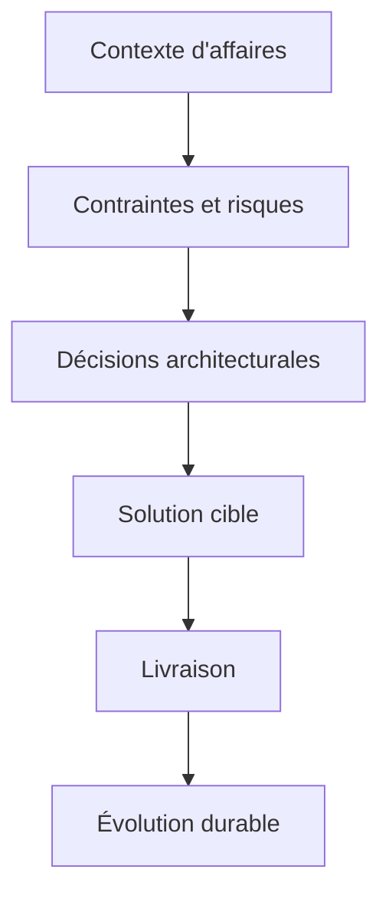

# Vision d'architecture

## Concevoir des systèmes qui durent

Je conçois une solution comme une composante d'un **écosystème d'entreprise**, pas comme une application isolée. Une bonne architecture doit pouvoir répondre aux besoins immédiats, tout en restant lisible, gouvernable et adaptable.

## Mes principes directeurs

### 1. Penser en frontières de systèmes

Avant de choisir une technologie, je cherche à clarifier :

- qui possède la donnée
- où s'arrête la responsabilité d'un système
- quels échanges doivent être synchrones ou asynchrones
- quelles règles doivent être centralisées ou distribuées

### 2. Commencer par le besoin d'affaires

L'architecture n'a de valeur que si elle traduit correctement le besoin opérationnel. J'accorde donc une importance particulière à :

- la modélisation des processus
- la compréhension des règles métier
- l'identification des irritants et des risques
- la qualité des compromis entre simplicité et couverture fonctionnelle

### 3. Traiter la sécurité comme une exigence de conception

La sécurité n'est pas une couche ajoutée à la fin. Elle doit influencer :

- le modèle de données
- les rôles et privilèges
- les intégrations
- la gestion documentaire
- les mécanismes d'audit et de traçabilité

### 4. Favoriser la pérennité

Je privilégie des architectures :

- compréhensibles par les équipes
- documentées clairement
- alignées sur les capacités réelles de la plateforme
- capables d'évoluer sans réécriture fréquente

## Vue d'ensemble

## Ce que cela change concrètement

Dans mes mandats, cette approche se traduit par :

- des décisions justifiables et documentées
- une meilleure cohérence entre les équipes affaires et TI
- une réduction du risque de dérive architecturale
- une base plus saine pour les évolutions futures
