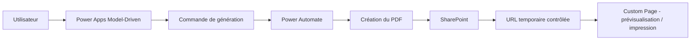

# Étude de cas — Système d'impression groupée de chèques

## Contexte

Dans une application model-driven Power Apps, le besoin consistait à permettre la génération et l'impression de plusieurs chèques en lot à partir d'une sélection d'enregistrements métier.

## Enjeux

- production documentaire sécurisée
- orchestration batch
- accès contrôlé au PDF généré
- expérience utilisateur simple dans un contexte administratif

## Architecture proposée

- **Power Apps model-driven** pour la sélection et le déclenchement
- **Power Automate** pour l'orchestration de la génération
- **SharePoint** pour le stockage contrôlé du PDF
- **Custom Page** pour la prévisualisation et l'impression

## Diagramme

## Décisions architecturales

### Centraliser la génération

La logique de génération a été placée dans le flux plutôt que dispersée dans l'interface, afin de mieux contrôler :

- la séquence de traitement
- les erreurs
- la réutilisation future

### Encadrer l'accès au document

Le PDF généré n'est pas exposé de façon permanente. L'accès se fait via un mécanisme contrôlé, mieux adapté à un contenu sensible.

### Favoriser le batch

La solution a été pensée pour traiter plusieurs chèques à la fois, afin de réduire la répétition manuelle et d'améliorer la productivité.

## Bénéfices

- réduction des manipulations répétitives
- meilleure cohérence du processus documentaire
- sécurité accrue autour des fichiers générés
- solution extensible à d'autres documents administratifs
