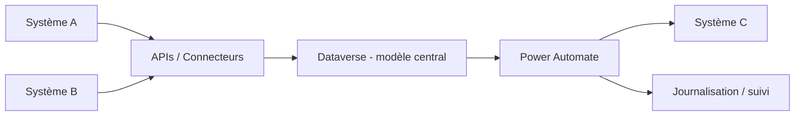

# Étude de cas — Hub d'intégration d'entreprise

## Contexte

Dans plusieurs organisations, les données sont éparpillées entre applications métier, outils bureautiques, flux automatisés et systèmes externes. Ce cas illustre une approche où Dataverse agit comme noyau de coordination, sans prétendre devenir la source universelle de toutes les données.

## Objectif

Améliorer la cohérence des échanges entre systèmes tout en réduisant la duplication, les synchronisations improvisées et les dépendances opaques.

## Architecture proposée

- **Dataverse** comme modèle central pour certaines entités métier
- **APIs** pour les échanges structurés
- **Power Automate** pour l'orchestration ciblée
- **Journalisation et supervision** pour les erreurs et reprises

## Diagramme

## Décisions clés

### Clarifier les sources de vérité

Toutes les données n'ont pas besoin d'être copiées partout. Une partie du travail architectural consiste à décider où une donnée doit vivre et comment elle doit être consommée.

### Limiter la complexité cachée

Les intégrations ponctuelles s'accumulent rapidement. J'essaie de rendre explicites :

- les contrats d'échange
- les fréquences de synchronisation
- les responsabilités de reprise
- les impacts de sécurité

## Bénéfices

- meilleure cohérence des échanges
- réduction des duplications inutiles
- architecture plus lisible
- fondation plus saine pour l'évolution future
