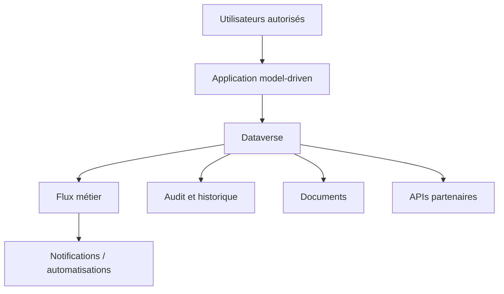

# Étude de cas — Gestion de dossiers judiciaires

## Contexte

Ce cas présente une architecture conceptuelle pour un système de gestion de dossiers judiciaires reposant sur Power Platform. L'objectif est de montrer une approche adaptée à des données sensibles, à des processus encadrés et à des exigences élevées de traçabilité.

## Besoins typiques

- gestion de dossiers, parties et événements
- suivi d'ordonnances et de décisions
- rôles distincts selon les responsabilités
- historique complet des actions
- intégration avec des systèmes partenaires et du stockage documentaire

## Risques à traiter

- accès non autorisé à des données sensibles
- incohérence entre les systèmes
- difficulté d'audit
- complexité croissante des processus

## Architecture cible

- **Dataverse** comme cœur transactionnel
- **Model-driven app** pour les opérations métier
- **Power Automate** pour les flux de traitement et notifications
- **Stockage documentaire** pour les pièces associées
- **Intégrations API** avec systèmes partenaires

## Diagramme

## Principes appliqués

- segmentation stricte des accès
- journalisation des actions critiques
- séparation entre données cœur et artefacts documentaires
- intégrations gouvernées par contrats explicites

## Résultats attendus

- meilleure traçabilité
- cohérence des règles métier
- architecture évolutive
- base solide pour la gouvernance et la conformité
