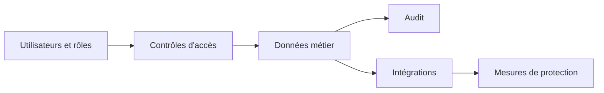

# Données et sécurité

## Sécuriser la solution dès sa structure

Je considère la donnée comme un actif stratégique. Son modèle, sa qualité, sa circulation et sa protection influencent directement la qualité de la solution.

## Architecture de données

Je porte attention à :

- la distinction entre données transactionnelles et de référence
- la définition des sources de vérité
- les règles de propriété et de mise à jour
- la gestion du cycle de vie des données

## Principes de sécurité

- moindre privilège
- séparation des responsabilités
- segmentation des accès
- journalisation des actions critiques
- protection des données sensibles dès la conception

## Traçabilité

Dans les contextes réglementés ou institutionnels, la traçabilité n'est pas un luxe. Une solution doit permettre de comprendre :

- qui a fait quoi
- à quel moment
- sur quelle donnée ou quel document
- dans quel contexte applicatif

## Diagramme simplifié

## Objectif

Obtenir des solutions où les besoins d'affaires sont servis **sans compromettre** la confidentialité, l'intégrité et la capacité d'audit.
