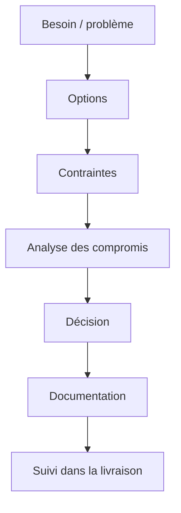

# Prise de décision architecturale

## Faire les bons compromis

L'architecture n'est pas la recherche d'une solution parfaite. C'est la recherche d'un compromis solide entre besoins, contraintes et évolutivité.

## Comment je décide

J'évalue systématiquement :

- la valeur d'affaires recherchée
- les contraintes de sécurité et de conformité
- les capacités réelles de la plateforme
- le coût de complexité
- la maintenabilité à moyen terme

## Questions que je pose souvent

- Cette décision améliore-t-elle réellement la solution ou ajoute-t-elle une sophistication inutile ?
- Le modèle de données est-il assez clair pour durer ?
- L'intégration est-elle observable et gouvernable ?
- Les équipes pourront-elles faire évoluer la solution sans la fragiliser ?

## Format simple de décision

## Mon objectif

Produire des décisions **claires, défendables et utiles**, pas seulement techniquement élégantes.
