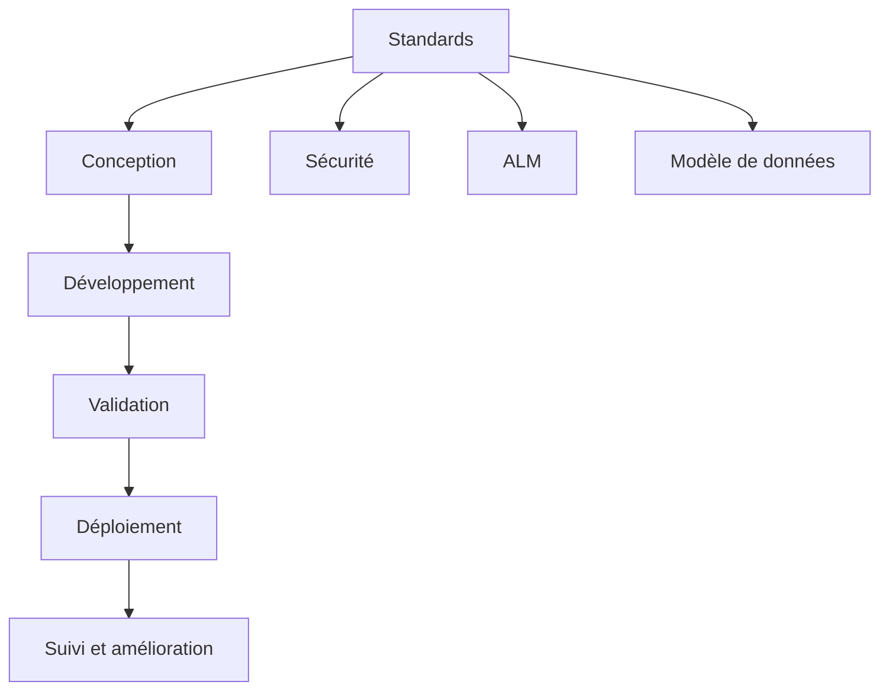

# Gouvernance Power Platform

## Faire de Power Platform une plateforme d'entreprise

Power Platform permet d'accélérer la livraison. Sans gouvernance, elle peut aussi accélérer la dette technique. Mon approche consiste à établir un cadre simple, réaliste et appliqué.

## Axes de gouvernance

### Environnements

- séparation Dev / Test / Prod
- règles claires de promotion
- contrôle des connecteurs et dépendances

### Solutions et ALM

- segmentation logique des composants
- usage de solutions gérées pour la production
- versionnement clair
- pipelines de déploiement

### Sécurité

- rôles de sécurité alignés sur les responsabilités
- limitation du sur-partage
- contrôle des accès aux données sensibles
- audit des changements critiques

### Standards

- conventions de nommage
- règles de modélisation Dataverse
- cadre de conception des flux
- critères de qualité et revues d'architecture

## Diagramme de gouvernance

## Résultat recherché

Une plateforme qui permet de livrer rapidement **sans perdre le contrôle**, avec une architecture cohérente, une sécurité maîtrisée et une meilleure capacité d'évolution.
