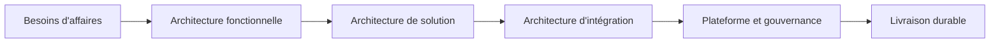

# Integration & Solution Architect

**Power Platform · Azure · Enterprise Systems**

Je conçois des solutions numériques **sécuritaires, évolutives et gouvernées** pour des organisations complexes, en faisant le pont entre les besoins d'affaires, les contraintes opérationnelles et l'architecture d'entreprise.

Mon positionnement repose sur quatre axes :

- **Compréhension fonctionnelle** des processus et des besoins d'affaires
- **Architecture d'intégration** orientée fiabilité, performance et pérennité
- **Gouvernance Power Platform** à l'échelle organisationnelle
- **Décisions architecturales pragmatiques** alignées sur le contexte réel

## Ce que je fais

- Concevoir des architectures de solutions robustes
- Structurer des intégrations API, événements, documents et flux batch
- Définir des modèles de données et des frontières de sécurité
- Encadrer la gouvernance, l'ALM et les standards de plateforme
- Accompagner les équipes de réalisation et les parties prenantes

## Ce que je cherche à démontrer

Ce site a été conçu comme un **portfolio d'architecture** plutôt qu'un simple CV. Il montre comment je réfléchis à :

- la durabilité des solutions
- l'intégrité et la traçabilité des données
- l'alignement entre technologie, métier et gouvernance
- la cohérence entre architecture cible et livraison

## Diagramme de positionnement

## Sections clés du site

- **Vision d'architecture** : ma façon de structurer les solutions
- **Architecture d'intégration** : patrons, principes et diagrammes
- **Gouvernance Power Platform** : sécurité, ALM, standards
- **Études de cas** : exemples concrets et conceptuels
- **Articles** : réflexions pratiques sur Dataverse, SharePoint et la gouvernance

## Public visé

Ce site s'adresse principalement à :

- recruteurs techniques
- gestionnaires TI
- architectes et responsables de gouvernance
- clients et partenaires recherchant un architecte capable d'unir **vision, intégration et exécution**
