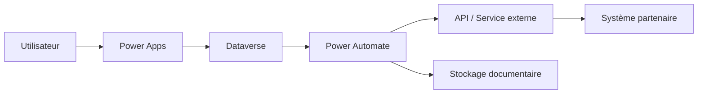

# Architecture d'intégration

## Concevoir des échanges fiables, sécuritaires et cohérents

L'intégration est souvent l'endroit où les solutions se fragilisent : duplication de données, dépendances mal définies, performance imprévisible, sécurité incomplète. Mon approche consiste à structurer les échanges pour qu'ils soient **explicites, mesurables et gouvernables**.

## Patrons d'intégration que j'utilise

### API-first

Approche recommandée lorsque :

- un service doit exposer des capacités réutilisables
- plusieurs consommateurs doivent accéder à la même logique
- la gouvernance des contrats d'échange est importante

### Événementiel

Approche utile lorsque :

- un changement dans un système doit déclencher des traitements ailleurs
- le découplage entre producteurs et consommateurs est souhaitable
- la résilience et l'évolutivité priment sur l'instantanéité

### Batch / synchronisation planifiée

Approche pertinente lorsque :

- les volumes sont significatifs
- la donnée n'a pas besoin d'être synchronisée en temps réel
- on veut réduire la pression sur les systèmes sources

### Intégration documentaire

Approche fréquente dans les contextes administratifs et judiciaires :

- génération de PDF
- entreposage documentaire
- accès contrôlé
- conservation, audit et traçabilité

## Exemples de technologies

- Dataverse
- Power Automate
- REST APIs
- Azure Functions / Azure Integration Services
- SharePoint pour certains scénarios documentaires

## Diagramme type

## Ce que je surveille systématiquement

- l'intégrité des données
- la gestion des erreurs et des reprises
- les limites de débit et de performance
- l'idempotence des traitements
- les impacts de sécurité et de confidentialité
- la cohérence des contrats d'intégration
